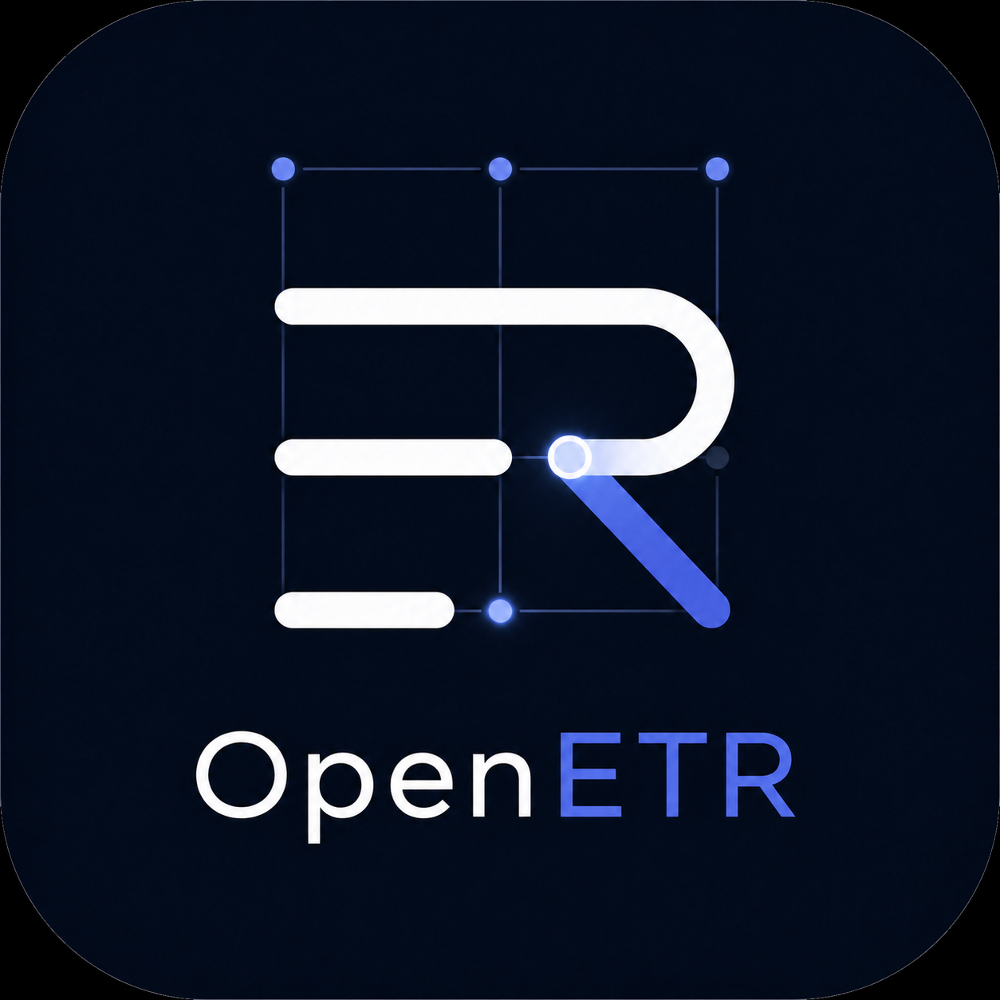

<section class="mainstay-hero" markdown>

# Mainstay

There's no place like home.

A unified local-first application that keeps essential information and value available and usable when conditions change.

[Explore the vision](product-vision.md){ .md-button .md-button--primary }
[Meet the product family](product-family.md){ .md-button }

</section>

**A dependable place for keys, records, payments, and community continuity.**

## Cooperative local operations

Mainstay starts with an ordinary need: people should be able to use important
records, service credits, approvals, and payment capabilities close to where
daily work happens. A community office, resort, campus, co-working facility, or
local service network may already coordinate members, guests, staff, providers,
records, and benefits across several tools. Mainstay is intended to give those
capabilities a dependable local home while keeping them connected to the wider
systems that already matter.

The goal is cooperative independence, not separation. A local deployment can
work with hosted services, regional providers, national registries, outside
mints, and ordinary payment networks when those services are useful and
available. It can also keep local work understandable when one of those systems
is slow, unavailable, or waiting to reconcile.

This is especially relevant for remote and Indigenous communities that want
digital tools aligned with local governance, trusted relationships, language,
service realities, and cooperative links to regional and national systems. The
same pattern also fits hospitality resorts, cruise ships, campuses, and
co-working facilities that need smooth local operations without turning every
interaction into a dependency on a distant platform.

## Records, credits, and trusted local work

Mainstay is intended to keep several practical questions clear:

- Which records are available here?
- Which local services can be reached now?
- Which credits, vouchers, or balances are confirmed?
- Which transfers or attestations are pending wider reconciliation?
- Which organization, issuer, professional, or community gives a record or
  credit its meaning?

A resort might issue guest credits, staff allowances, activity vouchers, or
meal credits that are recognized by shops, restaurants, and services on its
own network. A co-working facility might issue desk credits, boardroom hours,
printing credits, locker access, or event passes. An Indigenous community
program might issue locally governed service credits or preserve records and
attestations according to its own procedures while maintaining cooperative
links to external institutions.

In each case, Mainstay should keep the local instrument bounded and legible.
It should not imply that a resort credit is legal tender, that two community
programs are interchangeable, or that a local attestation replaces the
institution normally responsible for a record. It should show who issued the
thing, who recognizes it, what can be done locally, and what still needs to be
checked or finalized elsewhere.

## Preparedness as a benefit

The same local-first capacity also supports preparedness.

Emergency preparedness helps people get through a disruption. Business
continuity helps organizations keep operating. **Institutional preparedness**
helps a community preserve the practical capabilities it needs to function:
access to keys, funds, records, evidence, payments, and trusted local services.

This does not need to begin with a crisis. It begins with ordinary operating
realities: intermittent electricity, limited connectivity, an unavailable cloud
service, a payment provider outage, or records that cannot be reached at the
moment work needs to continue. The underlying institutions may still exist and
the problem may be resolved in a few hours or days. Until then, people still
need to carry out day-to-day business.

When connectivity returns, local activity can be reconciled with the wider
network rather than reconstructed from paper notes, memory, screenshots, or
fragmented application logs. Mainstay helps preserve a clear path between what
happened locally and the external systems that later confirm, recognize, or
settle it.

## Local-first, not local-only

Mainstay can use helpful hosted services in ordinary conditions. It is designed
so the user experience can also move toward local infrastructure when a
provider, mint, regional link, or wider network becomes unavailable.

The goal is not isolation. It is practical stewardship of the records, keys,
funds, evidence, and local services people need to continue operating.

<article class="mainstay-card" markdown>

### Connected

Use hosted services, public relays, external mints, and ordinary internet
connectivity.

</article>

<article class="mainstay-card" markdown>

### Local

Reach nearby Lockbox services directly when upstream access is unavailable.

</article>

<article class="mainstay-card" markdown>

### Mobile

Use a phone or nearby device as a temporary bridge while local approval stays
close.

</article>

<article class="mainstay-card" markdown>

### Community

Exchange records, events, and value across a local network or participating
mesh.

</article>

## A family with clear responsibilities

Each sibling product remains independently useful. Mainstay coordinates them
without becoming the authority or collapsing them into a monolith.

### Good boundaries, not barriers

Continuity depends on knowing which component holds which responsibility and
which authority. Clear boundaries keep a relay from becoming a mint, an
application from becoming the system of record, and one failure from silently
changing the meaning of another component's state.

Those boundaries should not become walls. Open protocols let keys, records,
funds, and signed evidence move across compatible applications, operators, and
infrastructure. Mainstay coordinates the family at those boundaries so each
product remains independently useful while the overall experience remains
coherent.

<a class="family-mark" href="https://trbouma.github.io/safebox-web/">
  
  <strong>Safebox Web</strong>User app
</a>
<a class="family-mark" href="https://trbouma.github.io/safebox-acorn/">
  
  <strong>Acorn</strong>Portable authority
</a>
<a class="family-mark" href="https://trbouma.github.io/stroma/">
  
  <strong>Stroma</strong>Nostr wire format
</a>
<a class="family-mark" href="https://trbouma.github.io/grove/">
  
  <strong>Grove</strong>Encrypted blobs
</a>
<a class="family-mark" href="https://trbouma.github.io/spurline/">
  
  <strong>Spurline</strong>Local events
</a>
<a class="family-mark" href="https://trbouma.github.io/clear/">
  
  <strong>Clear</strong>Local currencies
</a>
<a class="family-mark" href="https://trbouma.github.io/openetr/">
  
  <strong>OpenETR</strong>Transferable records
</a>

[See how the family fits together](product-family.md){ .md-button }

## Continuity without ambiguity

Mainstay should always distinguish what is available now, what is confirmed,
what remains pending, and what can be finalized later. A locally reachable
Clear mint can confirm its own currency inside a community network, while
proofs from an unreachable external mint remain pending until reconciliation.

Records follow the same principle: local copies preserve continuity, signed
events preserve evidence, and synchronization reconnects local work to the
wider network when available.

[Understand continuity](continuity.md){ .md-button .md-button--primary }

## A local home when it matters

<section class="lockbox-band" markdown>

### Lockbox

Lockbox is the hardware-first appliance direction for Mainstay. It provides a
dedicated local home for the family on a small, durable platform with local
storage, service supervision, hardware-backed controls, and physical presence.

The initial target is FreeBSD on Raspberry Pi 4 with a keypad and TROPIC01 HSM.

[Explore Lockbox](lockbox.md){ .md-button }

</section>

!!! note "An emerging product"
    Mainstay is currently a product vision and integration direction. The
    sibling components are being built and proven independently before the
    unified application and Lockbox appliance profile are assembled.
