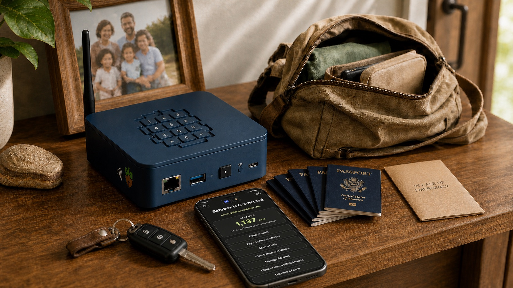

<section class="mainstay-hero" markdown>

# Mainstay

A dependable place for records, identity, payments, and community continuity.

A unified local-first application that keeps essential information and value understandable and usable when conditions change.

[Explore the vision](product-vision.md){ .md-button .md-button--primary }
[Meet the product family](product-family.md){ .md-button }

</section>

**Mainstay is the application. Lockbox is the appliance. Continuity is the capability.**

## When distant infrastructure disappears

A satellite link goes down. A distant cloud service starts behaving
unpredictably. A tornado takes out the local registry office and bank. Solar
power and backup systems are keeping the electricity on, but the community has
lost access to much of what it needs to function: payment services, critical
records, local evidence, and the remote systems used to coordinate them.

The people, funds, and records have not disappeared. The paths used to reach
them have. Mainstay is intended to provide a local point of continuity: keeping
nearby records and payment capabilities understandable and usable, supporting
community coordination, and reconciling with external systems when
connectivity returns.

## Local-first, not local-only

Mainstay can use helpful hosted services in ordinary conditions. It is designed
so the user experience can also move toward local infrastructure when a
provider, mint, satellite link, or wider network becomes unavailable.

The goal is not isolation. It is practical control over the records, keys,
funds, evidence, and local services people need to continue operating.

<article class="mainstay-card" markdown>

### Connected

Use hosted services, public relays, external mints, and ordinary internet
connectivity.

</article>

<article class="mainstay-card" markdown>

### Local

Reach nearby Lockbox services directly when upstream access is unavailable.

</article>

<article class="mainstay-card" markdown>

### Mobile

Use a phone or nearby device as a temporary bridge while local authority stays
close.

</article>

<article class="mainstay-card" markdown>

### Community

Exchange records, events, and value across a local network or participating
mesh.

</article>

## A family with clear responsibilities

Each sibling product remains independently useful. Mainstay coordinates them
without becoming the authority or collapsing them into a monolith.

<a class="family-mark" href="https://getsafebox.app">
  
  <strong>Safebox</strong>User app
</a>
<a class="family-mark" href="https://trbouma.github.io/safebox-acorn/">
  
  <strong>Acorn</strong>Portable authority
</a>
<a class="family-mark" href="https://trbouma.github.io/grove/">
  
  <strong>Grove</strong>Encrypted blobs
</a>
<a class="family-mark" href="https://trbouma.github.io/spurline/">
  
  <strong>Spurline</strong>Local events
</a>
<a class="family-mark" href="https://trbouma.github.io/clear/">
  
  <strong>Clear</strong>Local currencies
</a>

[See how the family fits together](product-family.md){ .md-button }

## Continuity without ambiguity

Mainstay should always distinguish what is available now, what is confirmed,
what remains pending, and what can be finalized later. A locally reachable
Clear mint can confirm its own currency inside a community network, while
proofs from an unreachable external mint remain pending until reconciliation.

Records follow the same principle: local copies preserve continuity, signed
events preserve evidence, and synchronization reconnects local work to the
wider network when available.

[Understand continuity](continuity.md){ .md-button .md-button--primary }

## A local home when it matters

<section class="lockbox-band" markdown>

### Lockbox

Lockbox is the hardware-first appliance direction for Mainstay. It provides a
dedicated local home for the family on a small, durable platform with local
storage, service supervision, hardware-backed controls, and physical presence.

The initial target is FreeBSD on Raspberry Pi 4 with a keypad and TROPIC01 HSM.

[Explore Lockbox](lockbox.md){ .md-button }

</section>

!!! note "An emerging product"
    Mainstay is currently a product vision and integration direction. The
    sibling components are being built and proven independently before the
    unified application and Lockbox appliance profile are assembled.
